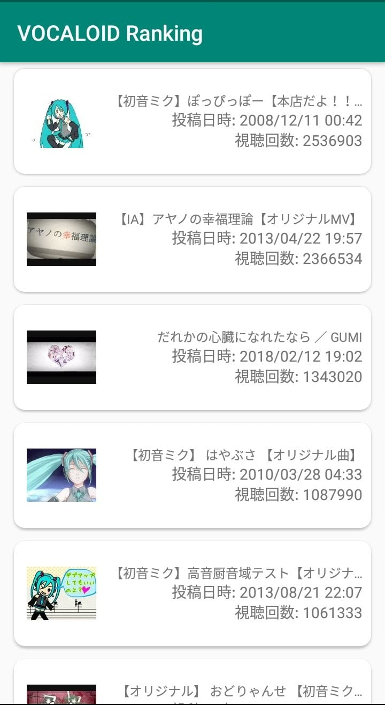

# VOCALOID Ranking

ニコニコ動画の情報を元にVOCALOID曲をスマホでランキング表示させます

# 機能
2018/12/07時点の実装済み機能

- ニコニコ動画の`#VOCALOID殿堂入り`タグがついている閲覧数上位20位の動画を表示
- CardStyleの導入
- サムネイルの表示
- タップしたら対象の動画が開く
- 起動時に「読み込み中」がでる

## 今後つけたい機能
**[Issue](https://github.com/OldBigBuddha/vocaloid-ranking/issues)で随時募集中**

- 読み込みアニメーションの追加
- 検索条件の変更
- ミリオン達成曲のStyleを特別に
- プレイヤー機能(バックグラウンドで再生したい)
- お気に入り曲の追加
- ニコニコ動画ログイン機能
- マイリスト作成/登録

# LICENSE
See [./LICENSE](./LICENSE)

This application includes the work that is distributed in the Apache License 2.0

(C) 2018 OldBigBuddha.
